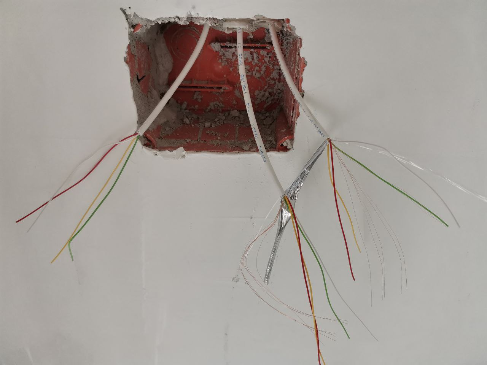
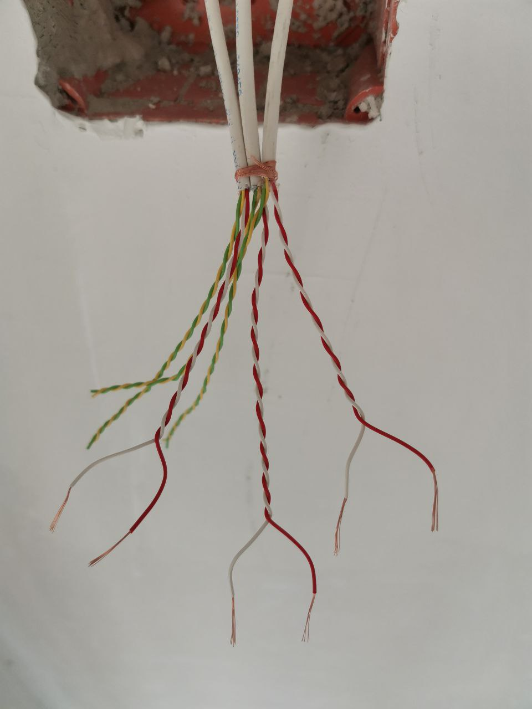
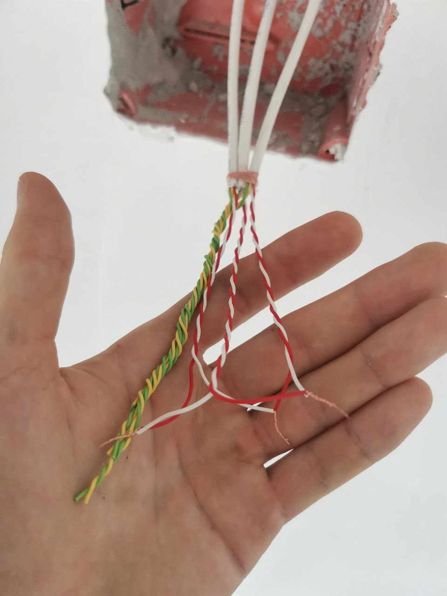
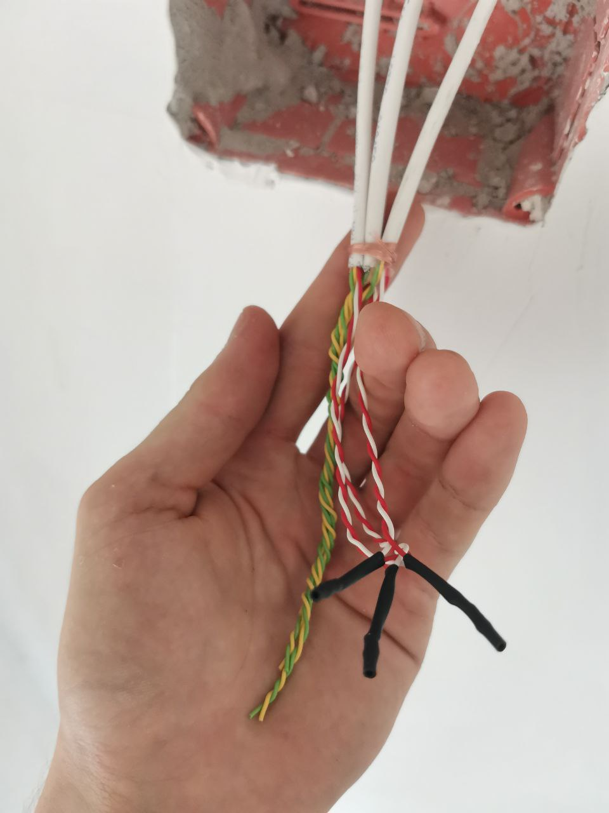
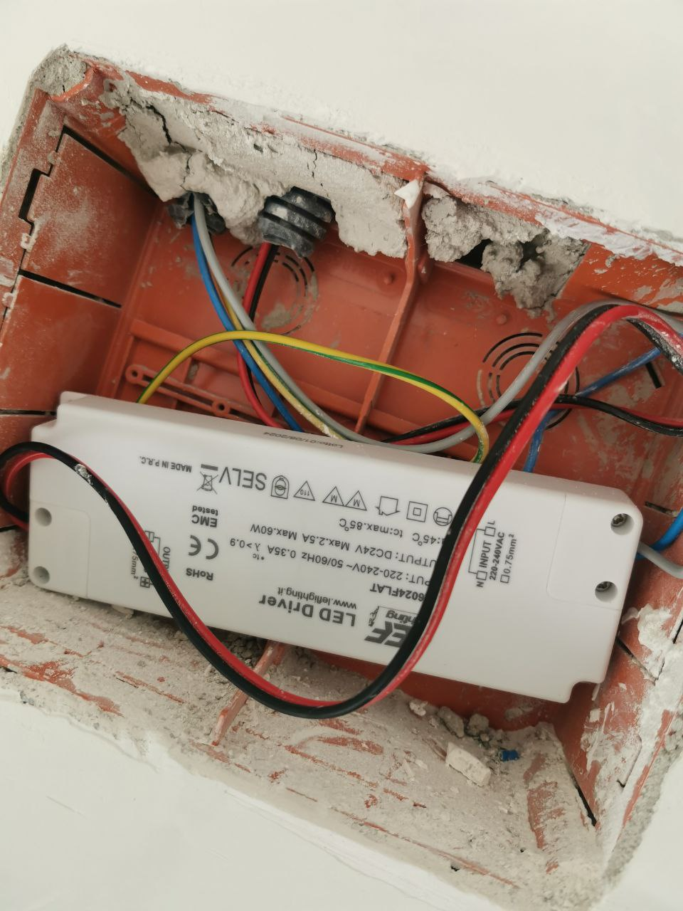

# Window-Sensor-Wiring-and-LED-Driver-Instalation

This project documents my practical work on installing a basic automation system to control an air conditioner using magnetic window sensors, as well as installing a 24V LED driver.

## 🪟 Window Sensors for AC Control

The purpose of this system is to automatically **disable the air conditioner when any window is open**. This is achieved using magnetic contact sensors wired in **series**.

### 🔧 What I Did:

- Stripped and joined wires using **electrician’s scissors**

  

- Connected multiple sensor wires **in series**

- Used **heat-shrink tubing** for safe and clean insulation

### 🧠 How It Works:
- Each window has a **magnetic sensor** (reed switch)
- All sensors are wired **in series**
- When any window opens, the circuit is **interrupted**
- This change is detected by the control system, which **turns off the air conditioner**

### 🧵 Cable Info:
- Used a single multi-core cable for all connections
- Internal structure:
  - **Outer shielding**: metallic foil wrap
  - **Transparent plastic film** for isolation
  - **Bare copper drain wire** (likely for grounding or shielding continuity)
  - **4 insulated signal wires** (each with its own colored insulation)
- Cable cores were joined by **twisting** and insulated using **heat-shrink tubing**

---

## 💡 LED Driver Installation

In this part of the project, I installed a basic **24V LED driver**. The process is simple but must be done carefully when working with **230V AC**.

### 🔧 What I Did:
- Connected **2 wires to 230V AC input**
- Connected **2 wires to 24V DC output**
- Placed the driver into a **flush-mounted wall box**
- Covered it with a **standard wall plate**

  

⚠️ **Note:** Always isolate power before working with AC connections. Work must follow local electrical regulations.
